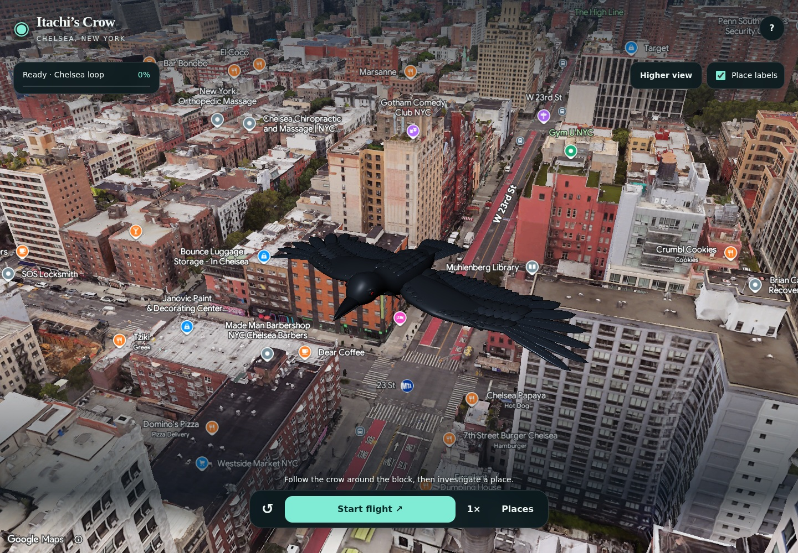
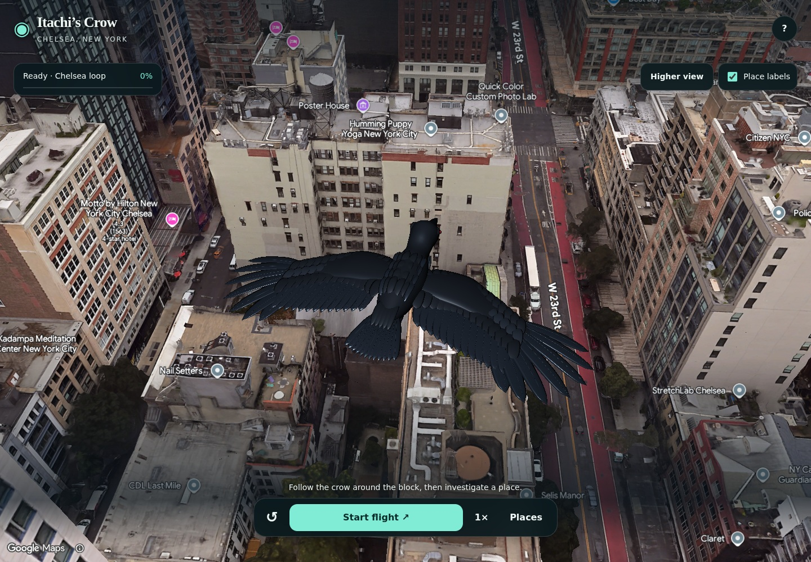
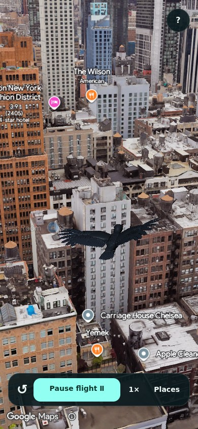

# Crow model redesign

The September 13, 2026 redesign replaces the segmented body with a continuous, smoothly lofted head, neck and torso. The wings now have curved leading edges, broad overlapping inner feathers, seven swept outer feathers per side, three layers of coverts and fine raised feather shafts. A twelve-feather tail, curved upper and lower beak, tucked feet and small crimson eyes complete the model.

The assets remain three native Google `Model3DElement` GLBs with the existing shared pivot, coordinate conversion and plain same-origin URLs. Flight, swerving, camera behaviour, Places and deployment configuration are unchanged. No texture downloads or new runtime dependencies are required. The geometry generator uses the existing pinned development dependencies.

The three files total 1,388,608 bytes and 58,000 triangles across 14 material groups. Khronos validation reports zero errors, warnings or informational hints. All exported meshes are closed and have consistent face winding.

The existing browser suite passed against the local development deployment using Chromium with SwiftShader and verified WebGL2 pixel readback. All six model requests returned HTTP 200; there were no console errors or model-request failures. Start, pause, resume, reset, swerving, live Places search (12 results), details and session saving passed. The 390×844 viewport passed start, pause and reset. Physical iPhone/Safari testing was unavailable; these checks do not establish hardware frame rates.

Visual review confirmed the actual crow inside the Google scene before flight, in both wing poses, on the sampled banked turn, in mobile flight and after mobile reset. Google attribution remains visible. Screenshots and the unmodified automated report are in [redesign evidence](evidence/redesigned-crow/).

The front and rear close-ups use an 18 m camera range for inspection only; the app retains its normal 48 m follow camera.

