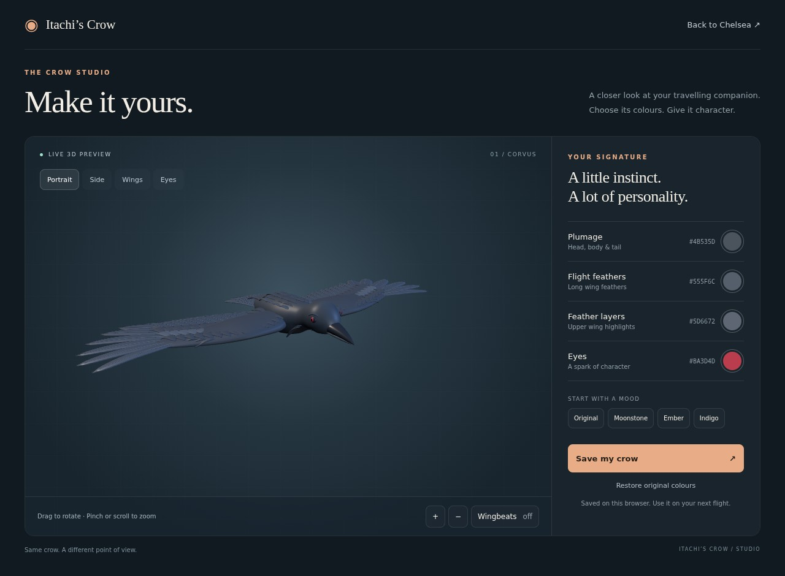
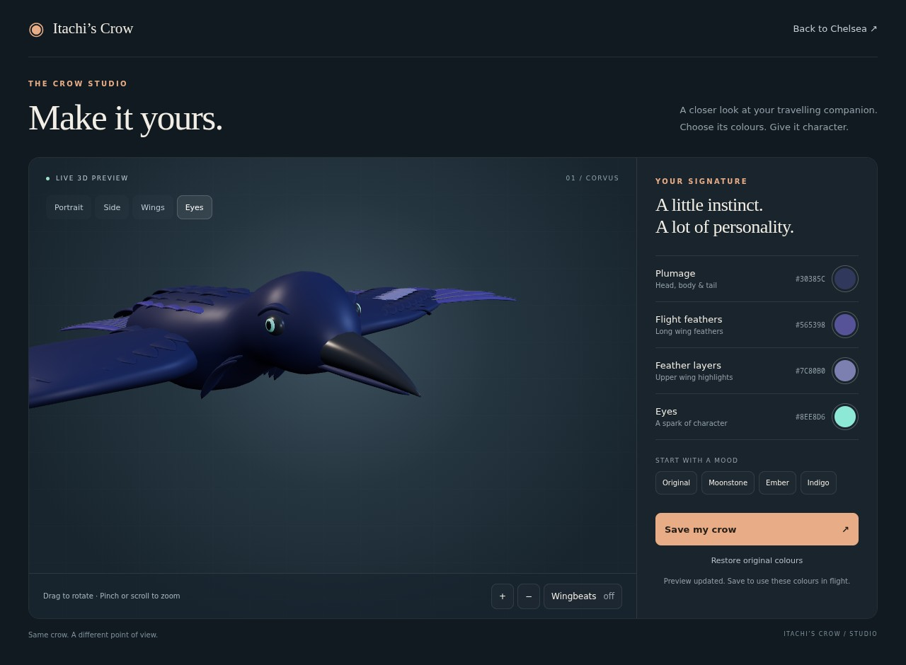
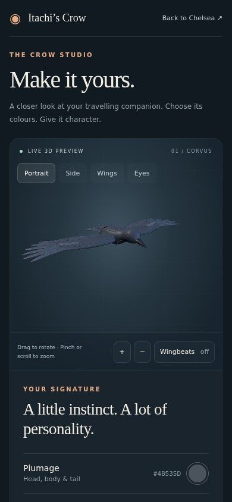
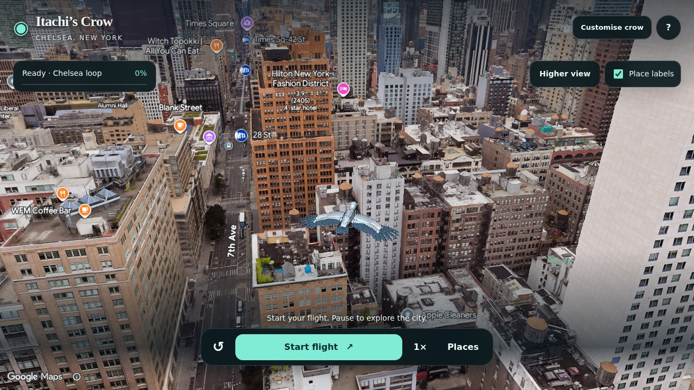

# Crow studio — 13 September 2026

The separate `customise.html` page previews the same three GLB assets as the city. It provides orbit/zoom controls, portrait/side/wing/eye cameras, wingbeat preview, four independent colour controls, presets and explicit Save/Restore actions. Designs persist in the current browser and origin, and apply on the next city-page load.

The preview uses bundled Three.js. City rendering remains Google's native `Model3DElement`. A service worker handles only `crow-colours/<four-colour-palette>/<part>.glb` requests, altering material colours in the original assets. Geometry, normals, articulation and material roughness remain unchanged. The service worker does not cache the app or intercept unrelated requests, and setup refuses to replace another worker at the app's scope.

## Verification

- Chromium with SwiftShader: WebGL2 red-pixel readback passed.
- Recoloured body and both wings: Khronos validation returned zero errors and warnings; binary geometry buffers remained byte-identical. Reset preserved original material definitions.
- Preview: visually checked the original design, alternate palettes, gold/green/turquoise eyes, wingbeat pose, orbit and zoom.
- Persistence: saved changed colours, reloaded, and confirmed the design returned. Simulated unavailable browser storage produced an error instead of a success message.
- Native city: visually confirmed the pale body and blue-grey wing feathers inside the city before flight, after moving and pausing, and after reset. Start, pause, resume and reset assertions passed. Google attribution stayed visible.
- Mobile: inspected the studio at 390 × 844, including the colour controls below the preview; no horizontal overflow. This is viewport testing, not a physical iPhone or Safari test.
- No uncaught page JavaScript errors were recorded in the complete studio/flight check. Places logic was not modified; the live Places flow was not rerun in this change.

The complete browser check is `npm run verify:studio` with `CROW_BROWSER_EXECUTABLE`, `CROW_SOFTWARE_GL=1` when needed, and `CROW_TEST_URL`. The machine-readable [report](evidence/crow-studio/report.json) contains the tested custom model URLs and checks. Final studio screenshots were refreshed after lighting/framing changes; the subsequent storage-failure check also passed.

## Screenshots

## Deployment limits

The private Zo development preview serves the updated files. GPT Sites production was not redeployed; its service-worker policy remains unverified. Deploy the complete `dist/` directory over HTTPS, including `crow-sw.js`, `crow-design.js` and the prebuilt studio bundle. No new Google API, application backend or Zo dependency is required. The studio itself does not load Google Maps or require a Maps key. Colours do not sync across devices or origins.
